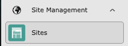
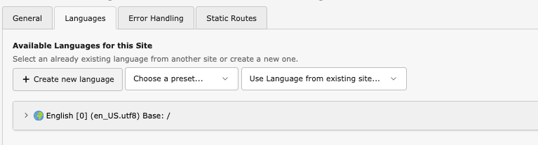

# Change TYPO3's Default Language

<!--#TYPO3v13 #Beginner #Configuration @ninaaline -->

TYPO3's default language configuration controls the primary language for your website content. Changing the default language ensures that your site displays content in the language that matches your target audience. This guide shows you how to modify the default site language in TYPO3 13.4.

## Learning objective

In this step-by-step guide you will learn how to change your TYPO3 site's default content language from English to another language using the Site Management module.

## Prerequisites

### Tools and technology

* A computer with a local TYPO3 13.4 installation
* Access to the TYPO3 backend (admin account)
* A web browser

### Knowledge and skills

* You know how to [Log in in to the TYPO3 backend](LogInToTheTypo3Backend.md)
* You have a basic understanding of [ISO language codes](https://en.wikipedia.org/wiki/List_of_ISO_639_language_codes) (e.g., "en" for English, "de" for German)

## Understanding the default language

TYPO3's default language is the primary language configured for your website content. This setting:

* Defines the language for your default content in the page tree
* Sets the fallback language when translations are not available
* Determines the language displayed to frontend visitors by default

The default language is always represented by language ID "0" in TYPO3's system.

> [!NOTE]
> This guide covers the *site content language* (what visitors see). The *backend interface language* (admin menu labels and buttons) is a separate setting that each backend user configures in their personal user settings.

## Change the default language

1. In the backend, navigate to **Site Management** > **Sites** from the left-hand menu.

   
2. Click on your site configuration (typically named "main" or your domain name) and open on the **Languages** tab.
3. Find the default language entry (listed first with language ID "0" and usually in English).
4. Click the on the default language entry.
5. The language configuration form is opening:

   

   **Update these fields:**

   * **Title**: Enter your new default language name (e.g., "German")
   * **Locale**: Enter the locale code by using the dropdown menu (e.g., "de_DE.UTF-8" for German, "fr_FR.UTF-8" for French)
   * **Language Tag**: Enter the IETF language tag (e.g., "de-DE" for German, "fr-FR" for French)
   * **Base URL**: Keep this as "/" (as your default page entry)
   * **Navigation Title:** Type in the Language Title for your Navigation (e.g. "German")
   * **Flag item:** Search for the right flag icon for your language
6. For German your changes should look like this now:

   

   Click **Save** to apply your changes.
7. Go to the **Page** Module and click on a page in the pagetree.

8. You can see a little flag-icon on your content. Verify that the new flag is shown.
   
9. Open your website's frontend in a new browser tab and verify that the language settings have been applied correctly.

## Summary

You successfully changed your TYPO3 site's default content language by editing the language configuration in the Site Management module. Your website now uses the new language for all default content.

> [!IMPORTANT]
> Changing the default language updates the language identifier and configuration, but does not automatically translate your existing content. You need to manually translate or update content to match the new default language.

## Next steps

Now that you've changed the default language, you might like to:

* [Configure additional content languages](../../20BuildingWebsites/20MultilingualWebsites/10ConfigureContentLanguages/Index.md) to create a multilingual website
* [Translate existing content](../../20BuildingWebsites/20MultilingualWebsites/20TranslateContent/Index.md) into your new default language
* [Manage language fallbacks](../../20BuildingWebsites/20MultilingualWebsites/30ManageLanguageFallbacks/Index.md) for handling missing translations

## Resources

* [TYPO3 Site Handling Documentation](https://docs.typo3.org/permalink/t3coreapi:sitehandling)
* [Language Configuration Reference](https://docs.typo3.org/permalink/t3coreapi:sitehandling-addinglanguages)
* [List of ISO 639 language codes](https://en.wikipedia.org/wiki/List_of_ISO_639_language_codes)
