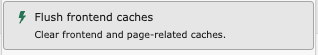

# Clearing the Frontend Cache in the TYPO3 Backend

<!--#TYPO3v13 #Beginner #Backend #Cache #FrontendCache @ninaaline -->

After making changes to your TYPO3 website's content, templates, or configuration, the site's frontend may not immediately reflect these updates.
This is typically due to the frontend cache, which stores a static version of your pages to ensure fast delivery to visitors.
To force the website to display your latest changes, you must manually clear this cache.

## Learning objective

In this step-by-step guide, you will learn how to clear the TYPO3 frontend cache using the Flush Frontend Caches function available in the administrative toolbar.

## Prerequisites

### Tools and technology

* A computer with a local TYPO3 installation
* Access to the TYPO3 backend (admin account or user with cache clearing permissions)
* A web browser

### Knowledge and skills

* You know how to log in into the TYPO3 backend
* You can locate and use the administrative toolbar in the TYPO3 interface.

## Understanding the Cache

TYPO3 employs a robust caching mechanism to optimize performance. When a user visits a page, TYPO3 renders it and then saves a copy (the cache) in the database or file system.

Frontend Cache: Stores the rendered HTML of website pages. Clearing this cache forces TYPO3 to re-render the pages using the current content and configuration, ensuring your changes are visible.

System Cache (or All Caches): Clears the frontend cache and internal configuration and class caches. This is usually only necessary after major template, configuration, or extension changes, or when doing a deep clean.

This guide focuses on clearing the Frontend Cache as it is the most common action required after content updates.

## Clearing the Frontend Cache

1. **Log in** to your TYPO3 backend
2. In the backend, locate the administrative toolbar at the top of the screen. This bar contains various administrative icons, including the cache icon.

   
3. Click on the lightning icon (the cache icon) in the administrative toolbar. This action will open a dropdown menu with two cache-related options.
4. From the dropdown menu, select the option labeled "Flush frontend caches"

   

Note: You might also see "Flush All Caches". Only use this option if "Flush Frontend Caches" doesn't solve your issue, as clearing all caches can take longer and may temporarily slow down the backend.

5. After clicking the option, the lightning icon will display a brief loading spinner animation to indicate the cache is being cleared. The spinner will disappear quickly (usually within a few seconds) once the process is complete.
6. Verify your changes by opening your website's frontend in a new browser tab and reloading the page. It's highly recommended to perform a **hard refresh** (pressing Ctrl + F5 or Cmd + Shift + R) to bypass your browser's local cache as well. The website should now display your latest updates.

## Summary

You successfully cleared the TYPO3 frontend cache by using the Flush Frontend Caches option in the administrative toolbar.
You confirmed the action's success by observing the loading indicator or notification, depending on your TYPO3 version.
