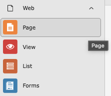
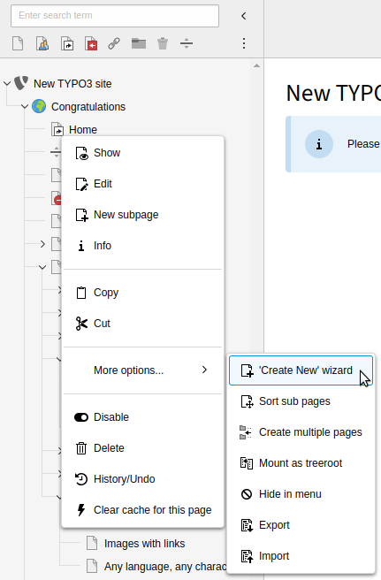
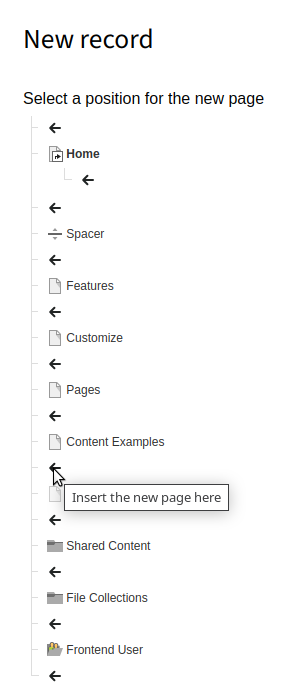

#Create a page with the context menu

{The template includes an HTML comment with different tags for categorization (look in the source code). Include the ones you think fits and feel free to add new ones. A tag like #TYPO3v13 indicates that the step-by-step guide has been tested in TYPO3 v13. To credit yourself as author, use "@" followed by your my.typo3.org username (e.g. "@username").}
<!-- #TYPO3v14 #Beginner #Backend #PageTree #Pages #ContextMenu @delfynn2kx -->

{Provide a conceptual overview.}

{Feature} enables you to {address pain point}. {Task you are going to learn} helps you {achieve goal}.

## Learning objective

In this step-by-step guide you will create a new page in the TYPO3 backend with the context menu.

## Prerequisites

### Tools and technology

*A computer with a local TYPO3 installation
*Access to the TYPO3 backend (editor or admin account)
*A web browser

### Knowledge and skills

*You know how to [log in into the TYPO3 backend](https://docs.typo3.org/m/typo3/guide-step-by-step/main/en-us/10GettingStarted/20BasicConfiguration/10BackendBasics/LogInToTheTypo3Backend.html#log-in-to-the-typo3-backend)
*You know how to [open the Page module](https://docs.typo3.org/m/typo3/guide-step-by-step/main/en-us/10GettingStarted/30ContentCreation/20AddContentElements/AddContentElements.html#open-the-page-module)

## Watch the video

{**Optional**. If available, embed the YouTube video version of this tutorial from the TYPO3 official channel.}

Watch this video to follow along with the steps below.

##Create a page using context menu

1. In the backend, open the Page module from the left-hand menu.

2. Expand the page tree to locate where you want to add the new page.

3. Right-click the parent page in the page tree
4. Select More options… > Create New wizard

5. Select the desired position for the new page using the arrow icons.

6. The Create new Page form opens. Enter a title and configure the page as needed, then click Save.

## Summary

You have learned how to create a new page using the context menu in the page tree and how to choose its exact position using the Create New wizard.

## Next steps

{List links to tasks that the learner could do next.}:

Now that you have {achieved goal}, you might like to:

* Add content to your page

* Work with the Rich Text Editor 

* Manage Media Assets

## Resources

* Creating Pages

