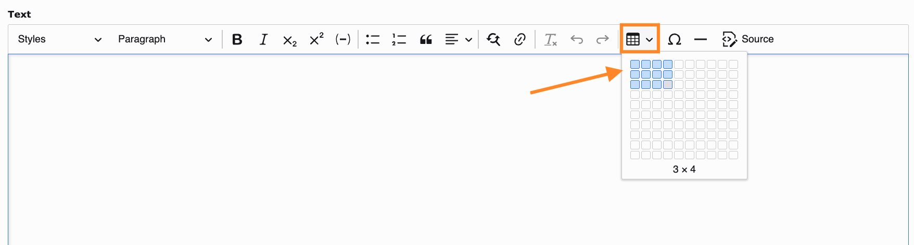
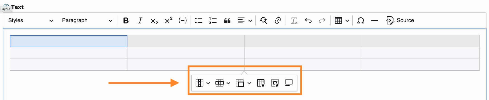
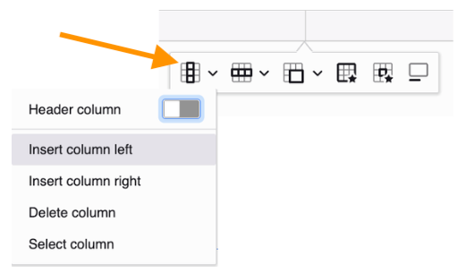
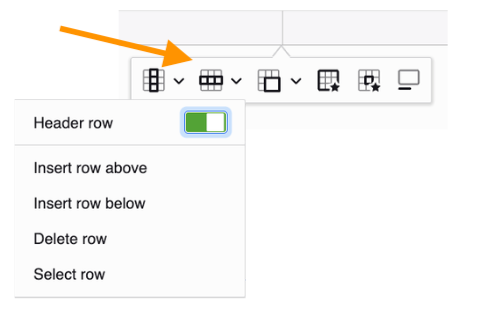
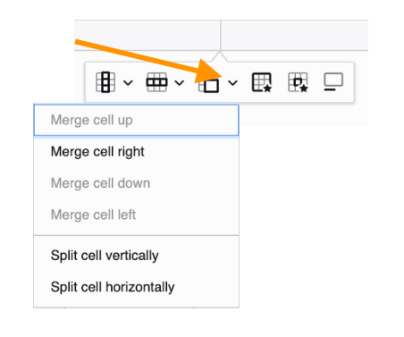
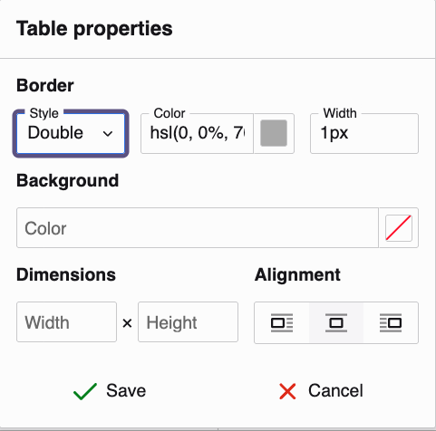
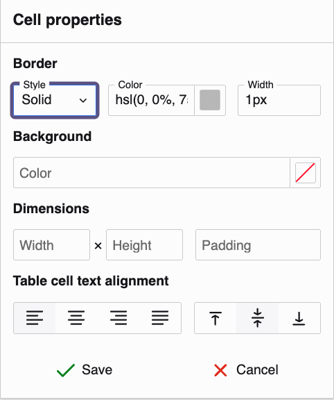
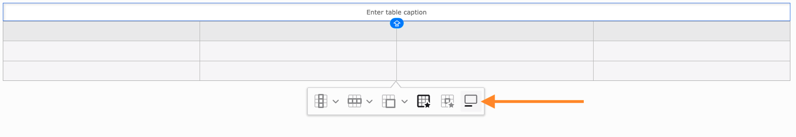

# Create tables in the Rich Text Editor
<!-- #TYPO3v14 #Beginner #ContentElements #Backend #Editing @delfynn2kx -->

Tables help organize content into rows and columns, making information easier to read and understand.

The Rich Text Editor (RTE) enables you to structure content visually. Creating tables helps you organize information clearly and present data in a structured format.

## Learning objective
In this step-by-step guide you will learn how to create tables, modify their structure, and manage table content using the Rich Text Editor in TYPO3.

## Prerequisites

### Tools and technology
* A running TYPO3 v14 instance
* Access to the TYPO3 backend (editor or admin account)
* A page containing a **Text** content element

### Knowledge and skills
* [Basic knowledge of editing content in TYPO3](https://docs.typo3.org/m/typo3/guide-step-by-step/main/en-us/10GettingStarted/30ContentCreation/20AddContentElements/AddContentElements.html)
* Familiarity with [the Rich Text Editor interface](https://docs.typo3.org/m/typo3/guide-step-by-step/main/en-us/10GettingStarted/30ContentCreation/30WorkWithTheRichTextEditor/Index.html)
* Permission to edit content on a page (see [Page permissions](https://docs.typo3.org/m/typo3/tutorial-getting-started/master/en-us/UserManagement/PagePermissions/Index.html))

## Insert a table
You can insert a table directly into your text using the table tool in the Rich Text Editor.

1. Open a page in the TYPO3 backend.
2. Create or edit an existing **Text** content element.
3. Place the cursor where you want to insert the table.
4. Click the **Table** icon in the Rich Text Editor toolbar.
5. Select the number of rows and columns from the grid.
6. Click to insert the table.  

The table appears in your content.
When the table is selected, a small menu appears next to it with table tools. This menu allows you to modify the table structure and properties. 

## Add or remove rows and columns
You can change the structure of the table using the table menu.

To modify columns: 
1. Click inside the table.
2. Click the **Column** icon in the table menu.
3. Select one of the following options:
- Header column
- Insert column left
- Insert column right
- Delete column
- Select column 

To modify rows:
1. Click inside the table.
2. Click the **Row** icon in the table menu.
3. Select one of the following options:
- Header row (enable by default)
- Insert row above
- Insert row below
- Delete row
- Select row 

The table structure updates immediately.

## Merge table cells
You can merge multiple cells into a single cell.

Option 1:
1. Select two or more adjacent table cells.
2. Click the **Merge cells** icon in the table menu.

Option 2:
1. Click inside the cell to be merged.
2. Click the arrow next to the **Merge cells** icon.
3. Select one of the following options:
- Merge cell up
- Merge cell right
- Merge cell down
- Merge cell left
- Split cell vertically
- Split cell horizontally
The selected cells are merged into one. 

## Modify table and cell properties
You can configure additional settings for tables and cells.

To modify table properties:
1. Click inside the table.
2. Click the **Table properties** icon.
3. Adjust settings such as:
- Border : Style, color and width
- Background color
- Dimension : width and height
- Alignment : left, center or right
4. Save or Cancel the changes 

To modify cell properties:

1. Click inside a table cell.
2. Click the **Cell properties** icon.
3. Adjust settings such as:
- Border : Style, color and width
- Background color
- Dimension : width and height - Padding
- Table cell text alignment : left, center, right or justify - align text cell to the top, middle or bottom
4. Save or Cancel the changes 

## Add a table caption
You can add a caption to describe the table content.

1. Click inside the table.
2. Click the **Toggle caption** icon in the table menu.
3. Enter the caption text above the table. 

The caption appears above the table.

## Remove table content
If you want to remove a table, you can delete its rows and columns.

1. Click inside the table.
2. Use the **Row** or **Column** menu.
3. Select **Delete row** or **Delete column**.
4. Repeat until all rows and columns are deleted.
The table disappears from the content.

## Summary
Congratulations! You now know how to create tables and manage their structure using the Rich Text Editor in TYPO3.

## Next steps
Now that you have created tables in the Rich Text Editor, you might like to:
* Format text inside the Rich Text Editor
* Create links inside content
* Insert images into text content