# Manage Media Assets
<!-- #TYPO3v14 #Beginner #ContentElements #MediaAssets #Backend #Editing @delfynn2kx -->

Media assets such as images, PDFs, and videos are stored and managed in the Media module. 
Organizing files into folders and maintaining clear file names helps keep the system structured and makes content easier to maintain.

In TYPO3 v14, the Media module replaces the former Filelist module. The Media module is used to store and manage all files used on your website.
It allows you to organize files, upload new media, and manage existing assets used on your pages.

## Learning objective

In this step-by-step guide you will learn how to:

* Create folders to organize files
* Upload files to the Media module
* Rename existing files
* Delete unused files

## Prerequisites

### Tools and technology

*A computer with a local TYPO3 installation
*Access to the TYPO3 backend (editor or admin account)
*A web browser

### Knowledge and skills

*You know how to Create and Organize Pages](https://docs.typo3.org/m/typo3/guide-step-by-step/main/en-us/10GettingStarted/30ContentCreation/10CreateAndOrganizePages/Index.html)
*You know how to [Add Content Elements to a Page](https://docs.typo3.org/m/typo3/guide-step-by-step/main/en-us/10GettingStarted/30ContentCreation/20AddContentElements/AddContentElements.html)
*You know how to Add Content Elements with Image or Media [(CREATE)](https://github.com/TYPO3-Documentation/TYPO3CMS-Guide-StepByStep/new/contrib/Documentation/00Incoming?filename=WorkWithTheRichTextEditor.md&value=Copy%20content%20the%20template%20from%3A%20https%3A%2F%2Fraw.githubusercontent.com%2FTYPO3-Documentation%2FTYPO3CMS-Guide-StepByStep%2Frefs%2Fheads%2Fcontrib%2FDocumentation%2F90Contribute%2F10Template%2FIndex.md)

## How to manage Media Assets

1.  In the backend, open the **Media** module from the left-hand menu.
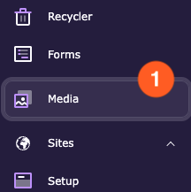

## Create a Folder
Folders help organize your media files and keep the Media module structured.
2. Click the **New folder** button or you can select the parent folder where you want to create a new folder.
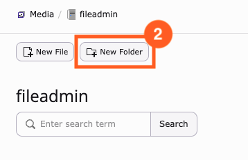

3. In the dialog box that opens, enter a name for the folder.
4. Click **Create.**
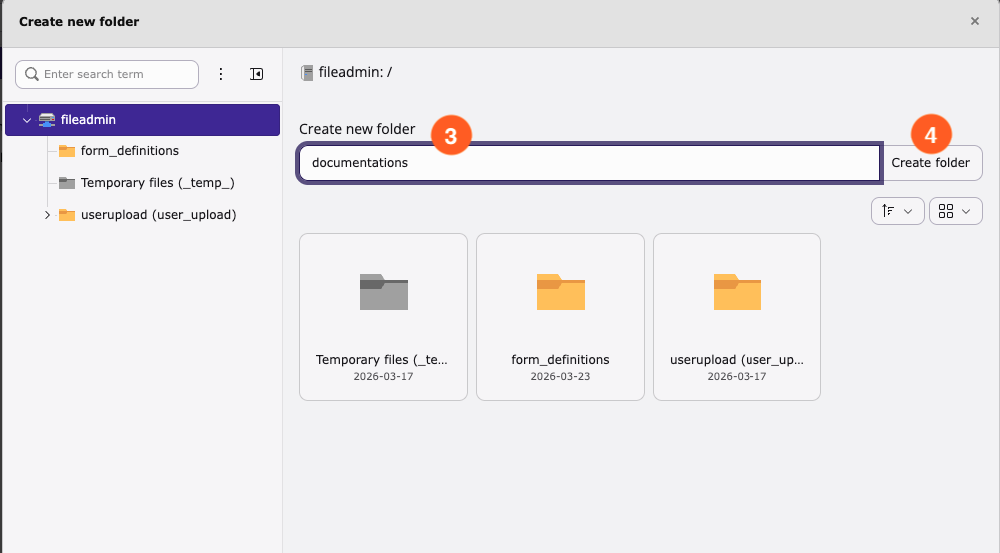

## Upload a File
You can upload images, PDFs, and other media files to use on your pages.
1. Select the folder where you want to upload the file.
2. Click the **New file** button.
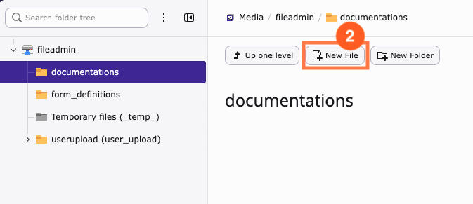

3.In the dialog box that opens, you have 3 options: 
 a. **Upload files:** Select one or more files from your computer.
 b. **Add new media asset:** Paste a media URL.
 c. **Create new textfile:** This option allows you to create a text-based file (such as .txt or .csv) directly in TYPO3. This feature is mainly used for technical purposes and is rarely needed for regular media uploads.
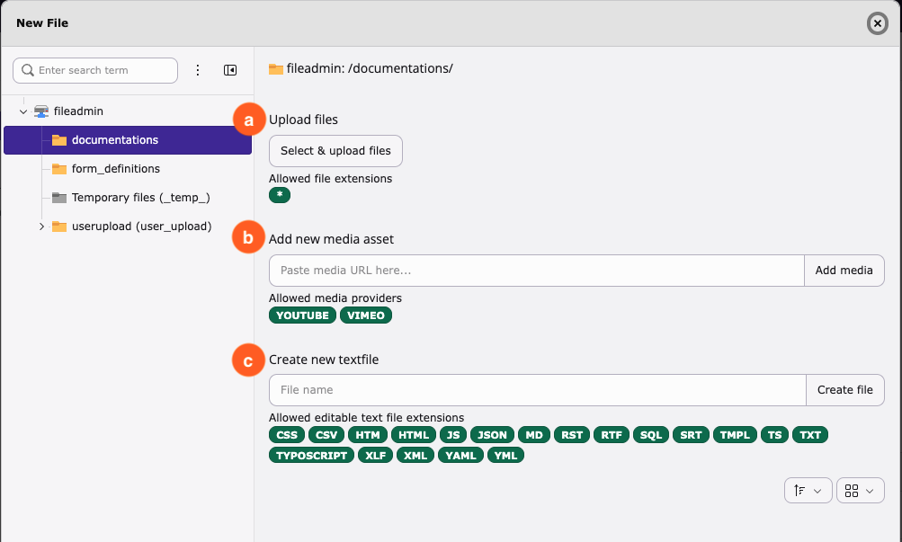

4. The file(s) will be automatically uploaded to the folder.
   
**Tip:**
 You can also drag and drop files directly into the folder.
## Rename a File
Renaming files helps maintain consistency and makes files easier to find.
Navigate to the file you want to rename.
**Option 1:** 
 a. If you are in **thumbnail view**, right-click the file and choose **Rename** 
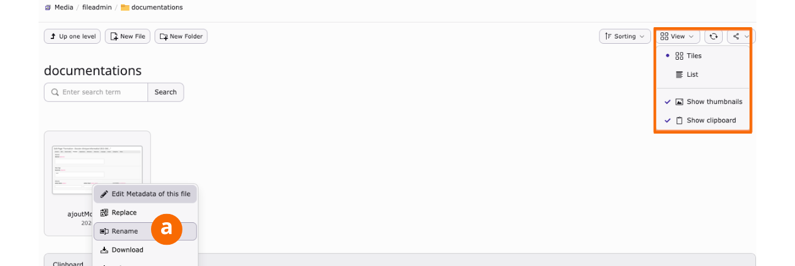
**Option 2:**
 b. If you are in **list view**, click the **three-dot menu (More actions menu)** next to the file and choose **Rename**.
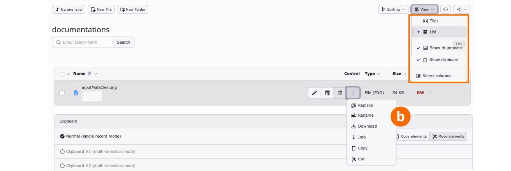

Enter the new file name.
Click **Rename** to save.

## Move a File
Moving files helps keep your folders organized and ensures files are stored in the correct location.
1. Navigate to the file you want to move.
2. Select the file using the checkbox next to it.
3. Click the **three-dot menu** next to the file and choose **Cut**.
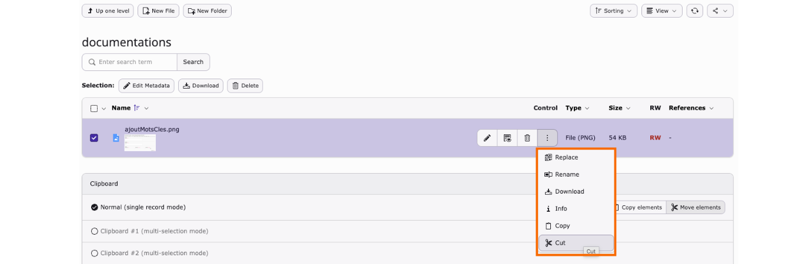

Navigate to the new folder you want to move your file.
Click **Paste in clipboard content** and confirm the move.
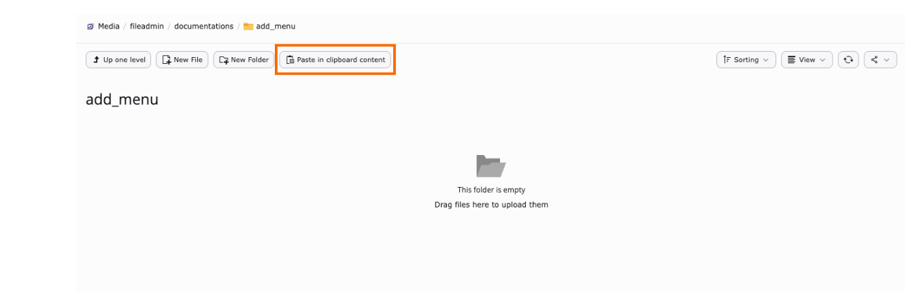

**Tip:**
Moving a file does not break existing references. Files that are already used on pages will continue to work after being moved.

## Replace a File
Replacing a file allows you to update an existing file without changing its references on pages.
This is especially useful when updating documents such as PDFs or replacing images that are already used on the website.
1. Navigate to the file you want to replace.
2. Click the **three-dot menu (More actions menu)** next to the file and choose **Replace**.
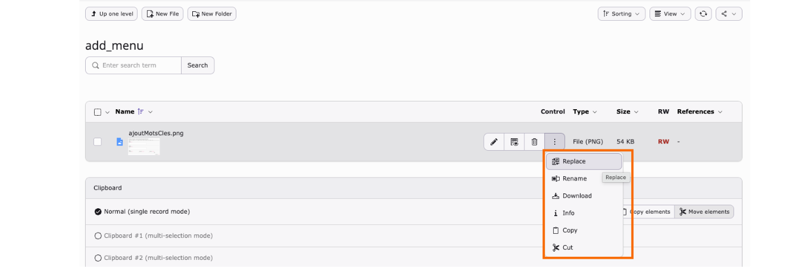
3. Select the new file from your computer.
4. Click **Replace** to confirm.
**Important**:
 Replacing a file keeps all existing references.
 Any page using the file will automatically display the updated version.
**Tip:**  
Use the replace function instead of uploading a new file with the same name. This helps maintain file history and avoids duplicate files.

## Delete a File
Delete files that are no longer needed to keep the Media library clean.
You have 2 options:
**Option 1:**
 1. In your folder, select the file(s) to delete.
 2. Choose **Delete** button.
 3. Confirm the deletion.
   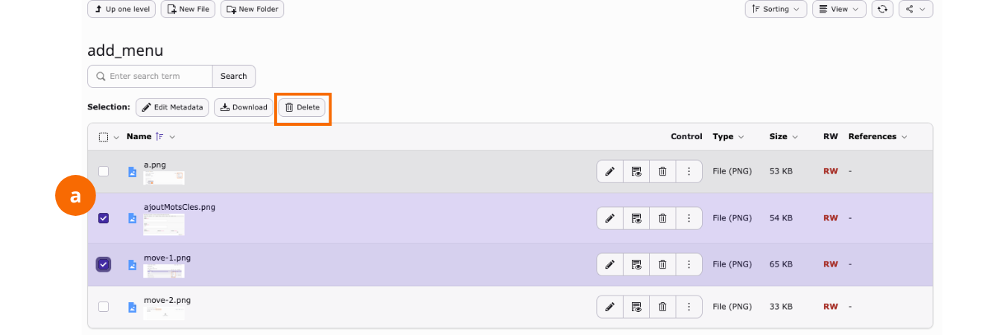

**Option 2:**
1. Select individually **Delete** icon next to the file.
2. Confirm the deletion.
 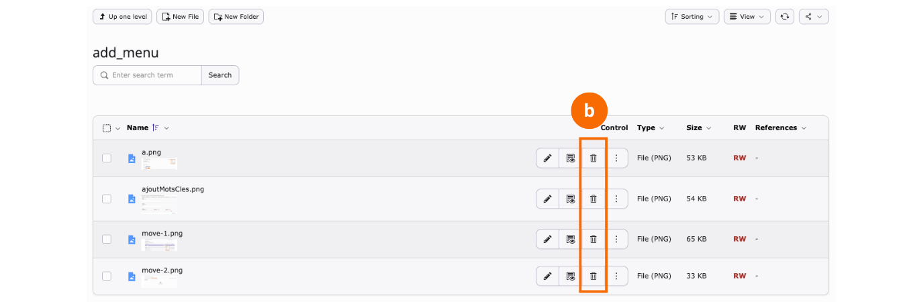

**Important:** 
A file cannot be deleted if it is still referenced on a page.
If the file is in use, TYPO3 will display a message indicating where the file is used. You must remove the file reference from the page(s) before deleting it.

## Summary

Congratulations! You now know how to create folders, upload files, rename files, and delete unused files in the Media module. 

These basic media management tasks help keep your TYPO3 installation organized and make it easier to maintain content across your website.

## Next steps

Now that you have learned how to manage media assets, you might like to:

* Add Media to a Content Element [(CREATE)](https://github.com/TYPO3-Documentation/TYPO3CMS-Guide-StepByStep/new/contrib/Documentation/00Incoming?filename=WorkWithTheRichTextEditor.md&value=Copy%20content%20the%20template%20from%3A%20https%3A%2F%2Fraw.githubusercontent.com%2FTYPO3-Documentation%2FTYPO3CMS-Guide-StepByStep%2Frefs%2Fheads%2Fcontrib%2FDocumentation%2F90Contribute%2F10Template%2FIndex.md)

