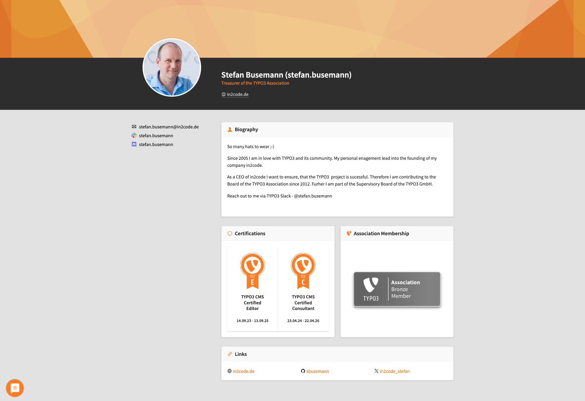
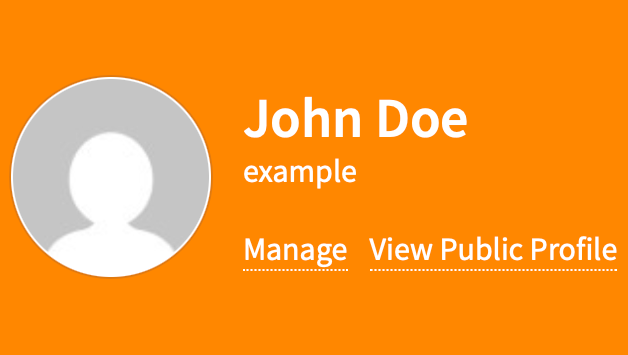

# Edit Your Public My TYPO3 Profile

<!-- #Beginner @mabolek -->

Public My TYPO3 profiles are an opportunity to showcase who you are and what you do to the rest of the TYPO3 community and beyond. Your personal profile page allows you to showcase your bio, contact information, and achievements — everything protected by fine-grained privacy settings.

## Learning objective

In this step-by-step guide you will edit your profile information and change the visibility (privacy) settings for your information.

Here's an example of [a real public profile](https://my.typo3.org/u/stefan.busemann), to show you how your profile could look:

## Prerequisites

### Tools and technology

* A computer with a web browser and an internet connection
* A My TYPO3 account. See how to [Sign Up for a My TYPO3 Account](SignUpForAMyTypo3Account.md)

### Knowledge and skills

* How to use a web browser

## Watch the video

[Watch this YouTube video](https://www.youtube.com/watch?v=oOqLihcwmDg) to follow along with the steps below.

## Navigate to the edit profile page

In order to edit your profile, you must firs log in to your My TYPO3 account and find your way to the edit profile page.

1. In your web browser, navigate to [my.typo3.org/login](http://my.typo3.org/login). If you are already logged in, you can continue from step 4.
2. Enter your username and password in the appropriate fields.
3. Click the *Log in* button. You will be forwarded to your *internal* user profile page.

4. In the large orange area, just below your name, click on the *Manage* link. You will be directed to your profile settings page.
5. In the navigation menu to the left, click on *Profile*. You will now see your edit profile page.

## Edit your profile

The edit profile page shows you information about your profile image (avatar), as well as editing fields for your profile information.

> [!NOTE]
> Your profile image is connected to your email address and is provided by Gravatar. To upload an image, you'll have to  [set up a Gravatar account](https://gravatar.com/connect).

1. Fill in the information you like in the appropriate fields.
2. Towards the bottom of the page, click the black *Add* button to create links that can be listed on your profile. Each link has three elements:
   * A drop-down menu for selecting the type of link. Example: *Facebook* or *Bluesky*.
   * A field for the URL or username you would like to link to, depending on your selection in the drop-down menu.
   * A checkbox to highlight the link. Checking it will display the link at the top of your profile.
3. Click the orange *Save* button to save your changes.

## Configuring the visibility of your information

Apart from your username (which is always visible) fields that do not have a visibility option next to them will always be hidden from everyone.

1. {Write the first step. Start with a verb.}
   {Optional: Code sample or screenshot that helps the learner complete this step.}
   {Optional: Expected outcome.}
2. {Write the next step. Start with a verb.}

{For Project guides, use this section to link to existing step-by-step guides}

## Summary

{State the outcome of the step-by-step guide to recap what the learner has achieved.}

Congratulations! You now have {outcome}.

## Next steps

{List links to tasks that the learner could do next.}:

Now that you have {achieved goal}, you might like to:

* Task 1
* Task 2
* Task 3…

## Resources

{**Optional**. List links to related material.}

* Resource 1
* Resource 2
* Resource 3…
