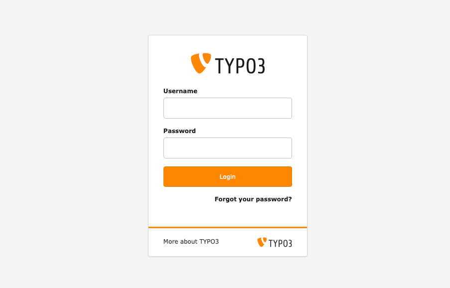

# Log In to the TYPO3 Backend

 **Tested in:** [TYPO3v13](/Tags/TYPO3v13.md) [TYPO3v14](/Tags/TYPO3v14.md) **Categories:** [Beginner](/Tags/Beginner.md) [Backend](/Tags/Backend.md) [Editing](/Tags/Editing.md) **Author:** [@mabolek](https://my.typo3.org/u/mabolek)

The backend of TYPO3 CMS is the password-protected area where editors and administrators log in to create pages, add content, manage users, and adjust how the website works.

Logging in to the backend gives you access to these features.

## Learning objective

In this step-by-step guide you will learn how to log in to the TYPO3 backend using a username and password.

## Prerequisites

### Tools and technology

* A computer with a web browser
* A username and password for a TYPO3 backend account

### Knowledge and skills

* Basic computer skills

## Access the login page

> [!NOTE]
> The login page is usually located at your website's domain name, appended with `/typo3`, for example `www.example.com/typo3`. For this guide, we will assume that this is true for your site. If the URL does not work, ask your site administrator for help.

1. In your web browser's address bar, enter the domain of your website, followed by `/typo3`, for example `www.example.com/typo3`.
2. Press the *enter* or *return* key on your keyboard. The login page should appear.

## Enter your login information

1. Enter your login information:
    * Username in the *Username* field.
    * Password in the *Password* field.
3. Press the *Login* button. You should now be forwarded to the TYPO3 backend.

> [!NOTE]
> If your username or password is incorrect, you will be prompted to try again. If you have forgotten your password, you can use the *Forgot your password?* link to reset it.

## Summary

Congratulations! You have now logged in to the TYPO3 backend.

## Next steps

Now that you have logged into TYPO3's backend, you might like to:

* [Create a Page With Drag and Drop](/10GettingStarted/30ContentCreation/10CreateAndOrganizePages/CreateAPageWithDragAndDrop.md)
* *Add Content to a Page* [(CREATE)](https://github.com/TYPO3-Documentation/TYPO3CMS-Guide-StepByStep/new/contrib/Documentation/00Incoming?filename=AddContentToAPage.md&value=Copy%20content%20the%20template%20from%3A%20https%3A%2F%2Fraw.githubusercontent.com%2FTYPO3-Documentation%2FTYPO3CMS-Guide-StepByStep%2Frefs%2Fheads%2Fcontrib%2FDocumentation%2F90Contribute%2F10Template%2FIndex.md "Create this missing step-by-step guide")
* [Modify the Page Properties](/10GettingStarted/20BasicConfiguration/10BackendBasics/ModifyingThePageProperties.md)

## Resources

* [Troubleshooting: Forgot password for backend login](https://docs.typo3.org/permalink/t3editors:login-forgot-password)
* [Troubleshooting common TYPO3 backend login problems for administrators](https://docs.typo3.org/permalink/t3start:troubleshooting-backend-login)
