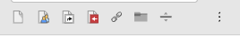
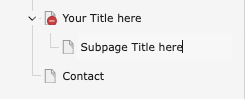

# Create a Page with Drag and Drop

<!--#TYPO3v13 #Beginner #Backend @ninaaline -->

TYPO3 lets you quickly create new pages directly in the page tree. The drag & drop method is a fast way to add a page exactly where you want it — either as a child of an existing page or as a sibling between two pages.

## Learning objective

In this step-by-step guide you will create a new page in the TYPO3 backend using the drag & drop method.

## Prerequisites

### Tools and technology

* A computer with a local TYPO3 installation
* Access to the TYPO3 backend (editor or admin account)
* A web browser

### Knowledge and skills

* You know how to log in into the TYPO3 backend
* You know how to open the **Page** module

## Watch the video

**[Watch this tutorial on YouTube](https://www.youtube.com/watch?v=UzHc1Z3vT6E&t=25s) to follow along.
*Only the first part of the video (creating a page with drag & drop) is relevant for this guide.*

## Create a page using drag & drop

1. In the backend, open the **Page** module from the left-hand menu.

   
2. Expand the page tree so you see the place where you want to add your new page.
3. At the top of the page tree, locate the **new page icons** (representing different page types).

   
4. Drag the **Standard page**icon
   and drop it:

   1. **Between two existing pages** → creates a sibling page at the same level
   2. **On top of an existing page** → creates a child page under that parent
5. When prompted, enter a title for your new page and press **Enter**
   
6. Confirm the new page appears in the page tree at the position you selected.

## Summary

You created a new TYPO3 page by dragging a page icon from the top of the page tree and dropping it into position. This is the quickest way to add pages while building your site structure.

## Next steps

Now that you’ve added a page, you might like to:

* [Enable a page]() so it becomes visible in the frontend
* [Create a page with the context menu]() for more precise placement
* [Add content to your page]()

## Resources

* [Creating pages in the TYPO3 Editors Tutorial](https://docs.typo3.org/m/typo3/tutorial-editors/main/en-us/Pages/CreatingPages/Index.html#pages-creating)
