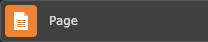
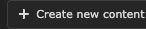
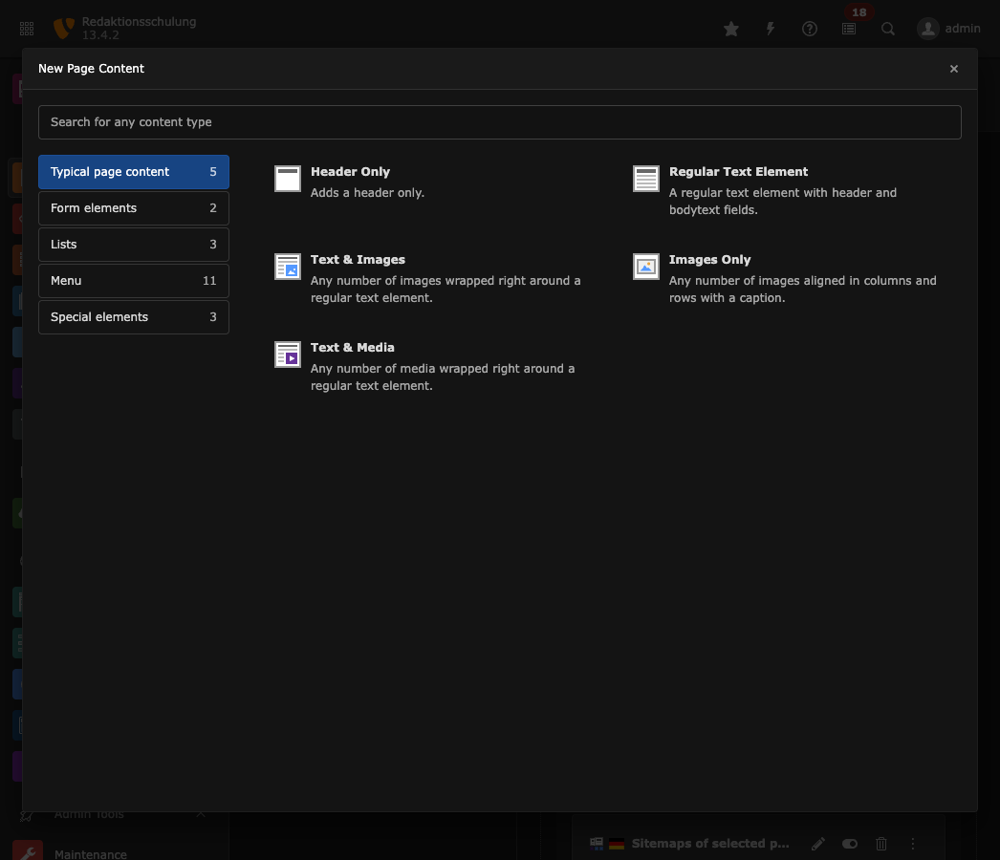
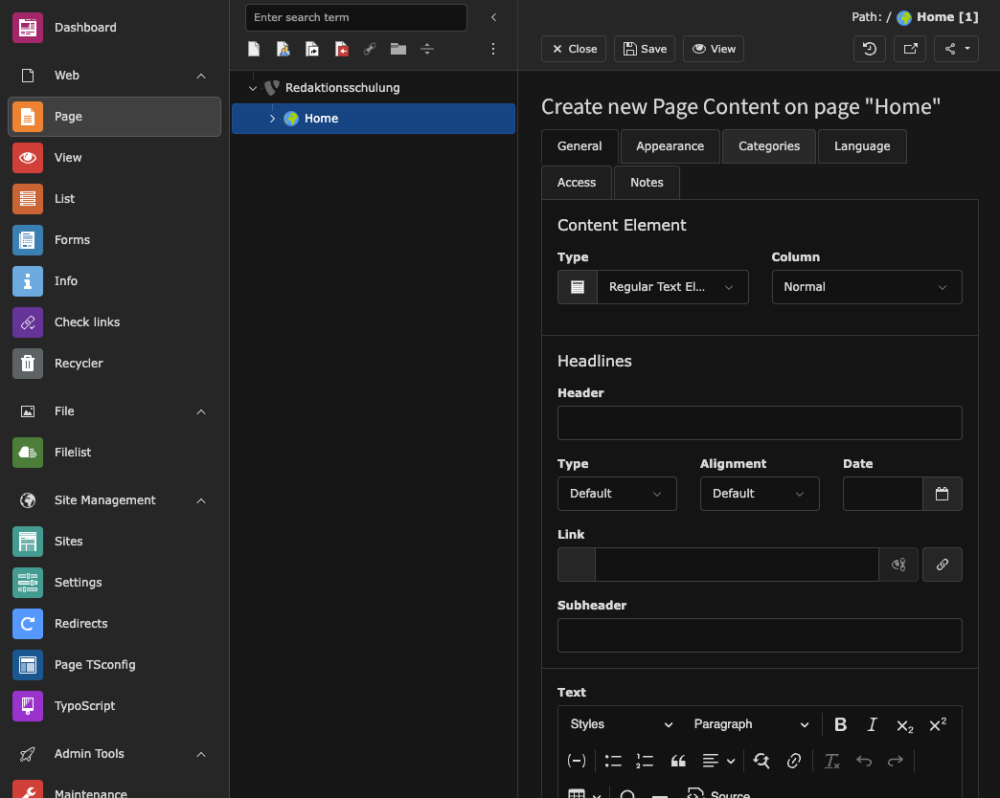
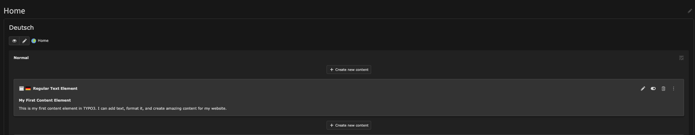
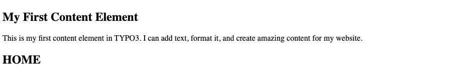

# Add Content Elements to a Page

span

Once you have created pages in your TYPO3 website, the next step is to fill them with content. TYPO3 uses content elements to build page content in a flexible and modular way. Content elements can be text blocks, images, headers, lists, or more complex components like forms or videos.

This guide shows you how to add content elements to a page using the TYPO3 Backend's **Page** module.

## Learning Objective

In this step-by-step guide, you will learn how to add content elements to a page in TYPO3 and explore the different types of content elements available.

## Prerequisites

### Tools and technology

* A computer with a local TYPO3 installation or access to a TYPO3 instance
* Access to the TYPO3 Backend with editor or administrator privileges
* A web browser
* At least one existing page where you want to add content

### Knowledge and skills

* You know how to log in to the TYPO3 Backend
* You have created at least one page (see [Create a Page with Drag and Drop](../10CreateAndOrganizePages/CreateAPageWithDragAndDrop.md))

## Open the Page Module

1. Log in to the TYPO3 Backend.
2. Open the **Page** module from the left-hand menu.

   
3. In the page tree on the left, click on the page where you want to add content.

## Add a Content Element

1. In the main content area, locate the area where you want to add your content element. You will see a **+ Content** button or a similar placeholder.

   
2. Click on the **+ Content** button. This opens the **New Content Element Wizard**, which displays all available content element types organized by category.

   
3. Browse through the available categories:

   * **Typical Page Content** – Standard elements like text, text with images, lists, and tables
   * **Form Elements** – Contact forms and other form-related components
   * **Lists** - Elements that display categorized content or pages from your site structure
   * **Menu** - Navigation elements like page menus, sitemaps, and section indexes
   * **Special Elements** – Advanced elements like HTML code, menu sections, or dividers
4. Select a content element type by clicking on it. For this guide, we will select **Regular Text Element** from the **Typical Page Content** category.

## Configure the Content Element

1. After selecting a content element type, TYPO3 opens the content element editor.

   
2. Fill in the fields:

   * **Header** – Enter a headline for your content element (optional)
   * **Text** – Enter your content in the Rich Text Editor (RTE). You can format text, add links, or insert images using the editor toolbar.
3. Optionally, configure additional settings in the tabs at the top:

   * **Appearance** – Control the layout and styling of the element
   * **Access** – Set visibility and access restrictions
   * **Language** – Manage translations for multilingual sites
   * **Categories** – Assign the element to content categories
4. Click **Save and close** at the top of the editor to save your content element and return to the Page module.

## Verify the Content Element

1. After saving, your new content element appears in the Page module's content area.

   
2. To view your content element on the frontend, click the **View webpage** button in the top toolbar or navigate to your website in a new browser tab.

   

> [!NOTE]
> If your changes do not appear immediately on the frontend, you may need to clear the frontend cache. See [Clearing the Frontend Cache in the TYPO3 Backend](../../20BasicConfiguration/10BackendBasics/ClearingFrontendCacheInTypo3Backend.md).

## Summary

You successfully added a content element to a page in TYPO3. You learned how to open the Page module, select a content element type from the New Content Element Wizard, configure the element, and verify it on the frontend.

## Next Steps

Now that you've added content to your page, you might like to:

* [Work with the Rich Text Editor](../30WorkWithTheRichTextEditor/WorkWithTheRichTextEditor.md) to format your text content
* [Manage Media Assets](../40ManageMediaAssets/ManageMediaAssets.md) to add images and other media to your content
* [Create Custom Content Elements](../../../20BuildingWebsites/10ContentManagement/20CreateCustomContentElements/CreateCustomContentElements.md) for more advanced layouts

## Resources

* [Working with Content Elements in the TYPO3 Editors Tutorial](https://docs.typo3.org/permalink/t3editors:content-working)
* [Content Elements Reference](https://docs.typo3.org/permalink/t3coreapi:content-elements)
