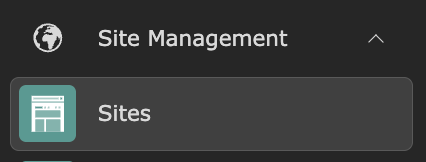
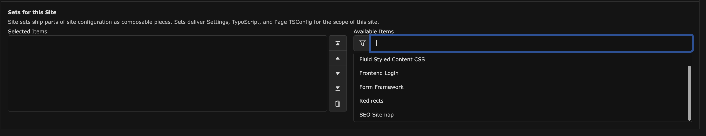
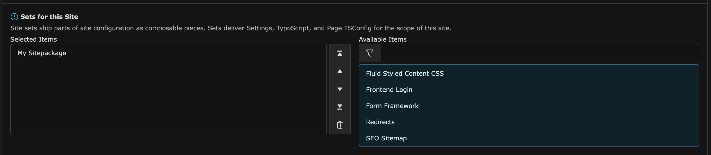

# Activate the Site Package

<!-- #TYPO3v13 #Beginner #SitePackage #Backend @ninaaline -->

After [creating the file structure](CreateTheSitePackageFileStructure.md) and [registering and installing the Site Package](RegisterAndInstallSitePackage.md), the Site Package is recognized by TYPO3 but not yet linked to any site. To make it functional, you need to activate its Site Set in the TYPO3 Backend.

This guide shows you how to assign the Site Set to your site through the Site Configuration.

## Learning Objective

In this guide, you will learn how to activate your Site Package by adding its Site Set to your site using the TYPO3 Backend's **Sites** module.

## Prerequisites

### Tools and technology

* Access to the TYPO3 Backend with administrator privileges

### Knowledge and skills

* You have completed the [Create the Site Package File Structure](CreateTheSitePackageFileStructure.md) guide.
* You have completed the [Register and Install a Site Package](RegisterAndInstallSitePackage.md) guide.

## Open the Site Configuration

1. Log in to the TYPO3 Backend.
2. Open the **Sites** module from the module menu.
    
3. Click on your site (e.g. "Home") to open its configuration. 
4. Scroll down to the **Site Sets** section and select **My Site Package** from the list of available items by clicking on it. 
5. Confirm that your Site Package now appears in the list of selected items. 
6. Click **Save** to save your changes.
7. Clear the frontend cache. If you are unsure how to do this, refer to [Clearing the Frontend Cache in the TYPO3 Backend](ClearingFrontendCacheInTypo3Backend.md).

## Summary

You have successfully activated your Site Package. Its Site Set is now assigned to your site, and all bundled configuration is active. You are now ready to start customizing your site package with templates, styles, and more.

## Next Steps

Now that your Site Package is fully active, you might like to:

* [Create a Site Set with Editable Settings and Custom CSS](../../20BasicConfiguration/40UsingSiteSets/CreateASiteSet.md)

## Resources

* [Site Sets](https://docs.typo3.org/permalink/t3coreapi:site-sets)
* [Site Handling](https://docs.typo3.org/permalink/t3coreapi:sitehandling)
