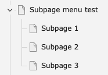
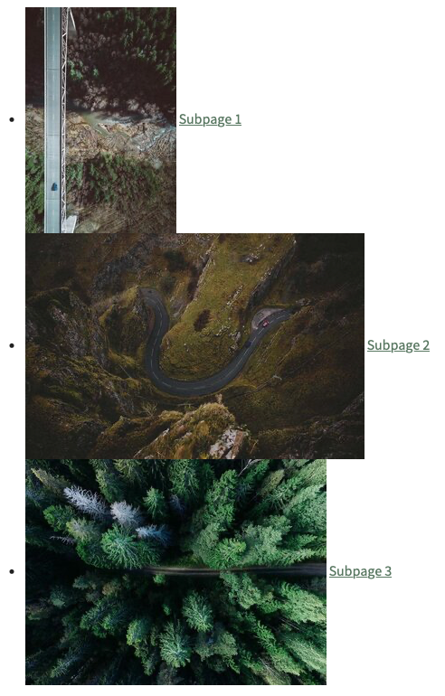

# Customize a content element template

<!-- #TYPO3v13 #Beginner #ContentElements #Frontend #Templating @mabolek -->

TYPO3 is modular by design and organizes content on a page as blocks, called content elements. You can customize how content elements are displayed on your website by overriding the default template.

## Learning objective

In this step-by-step guide you will override the Subpages content element. This content element displays a list of subpages to the current page. We’ll modify the template so it also displays an image together with the name of each subpage.

## Prerequisites

### Tools and technology

* A computer with a local TYPO3 development environment installed using Composer
* A site in the development environment using the [Bootstrap Package](https://www.bootstrap-package.com) theme
* A Boostrap Package-based [sitepackage](https://docs.typo3.org/permalink/t3sitepackage:start) extension
* An IDE or plain text editor

### Knowledge and skills

* TYPO3’s file structure
* Basic content editing with TYPO3

## Create a page and subpages

To have something for the Subpages content element, we’ll create a page in the page tree and then add some subpages to it.

1. In the page tree, create a page with a number of subpages as described in [Creating Pages](https://docs.typo3.org/permalink/t3editors:pages-creating). In our case, we create a page called “Subpage menu test” with three subpages called “Subpage 1,” “Subpage 2,” and “Subpage 3.”

    

2. For each of the subpages
    1. Access the page’s page properties, as described in [Page Properties](https://docs.typo3.org/permalink/t3editors:pages-properties).
    2. In the page properties form, click on the Resources tab.
    3. Under Files, upload an image or add a relation to an existing image.
3. On the page “Subpage menu test”, add a content element of the type “Subpages,” using the steps in [Add content in the TYPO3 backend](https://docs.typo3.org/permalink/t3sitepackage:cm-typo3-backend-add-content).

If you preview the page “Subpage menu test,” the content should look something like this:


## Copy the content element template file

It is not recommended to edit the original template file. These can easily be overwritten during upgrades. Instead, we make a copy of the template file and place it within our sitepackage extension.

1. Locate the MenuSubpages.html template file within the folder `vendor/bk2k/bootstrap-package/Resources/Private/Templates/ContentElements`.
2. Copy the file into your sitepackage extension’s `Resources/Private/Templates/ContentElements` folder. Don’t change the file name.

The sitepackage extension is already configured so TYPO3 will look for custom content element templates in this location.

## Modify the template file

1. Open the file you just created using your IDE or a plain text editor: `Resources/Private/Templates/ContentElements/MenuSubpages.html`
2. Add this code on a blank line after the `<li>` tag:

    ```html
    <f:image image="{page.files.0}" height="250" /\>
    ```

3. Clear TYPO3's cache as described in [Clearing the Frontend Cache in the TYPO3 Backend](../../../10GettingStarted/20BasicConfiguration/10BackendBasics/ClearingTheFrontendCacheInTheTypo3Backend.md)

## Summary

You have now overridden the Fluid template of the Subpages content element so it also displays an image together with the name of each subpage in the list.

The final result should look something like this:



## Next steps

Now that you have overridden a content element's Fluid template, you might like to:

* [Add custom CSS Styles to a Fluid Template](../../40FrontendDevelopment/40AddCustomJavaScriptAndCSS/AddCustomCssStylesToAFluidTemplate.md)

## Resources

* [Create a custom content element type](https://docs.typo3.org/permalink/t3coreapi:adding-your-own-content-elements)
* [Overriding the default templates of content elements](https://docs.typo3.org/permalink/t3sitepackage:content-element-rendering)
