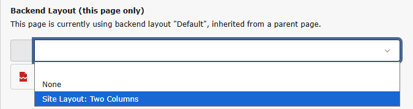
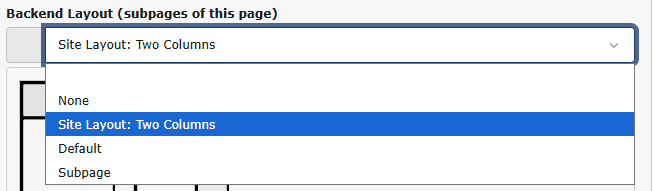
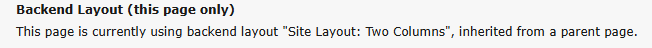

# Configure a Backend Layout With Two Columns

<!-- #TYPO3v13 #Intermediary #Backend #BackendLayout @csabareanu -->

A *Backend Layout* controls how rows and columns of content elements are displayed in TYPO3’s **Page** module, letting editors place their content in designated areas. Though they don't affect frontend rendering directly, backend layouts usually correspond to specific frontend web page layouts.

## Learning Objective

In this step-by-step guide you will create a custom Backend Layout with two columns in an existing Site Package and apply it to all subpages of a specific starting page. The columns will be named:

* “Left” (colPos = 0)
* “Right” (colPos = 2)

They will be displayed as two vertical columns in the **Page → Columns** view in the TYPO3 Backend.

## Prerequisites

### Tools and technology

* A computer with a local [Composer-based TYPO3 installation](https://docs.typo3.org/permalink/t3coreapi:installation-composer) where you have admin access.
* Your TYPO3 installation must have an active Site Package as explained in [Create a Site Package](CreateASitePackage.md). This guide assumes your sitepackage is called `sitepackage`.
* Your site package must include a site set as explained in [Create a Site Set](CreateASiteSet.md).

### Knowledge and skills

* [Using the Page Tree](https://docs.typo3.org/permalink/t3start:page-tree)
* [Modifying the page properties](ModifyingThePageProperties.md)
* [Adding Page TSconfig to a Site Package](AddingPageTSConfigToASitePackage.md).
* Basic understanding of `colPos` property for content columns

## Define the Backend Layout in Page TSconfig

You will store Backend Layout definitions in your Site Set’s Page TSconfig.

1. Open or create the file `EXT:sitepackage/Configuration/Sets/base/page.tsconfig`.
2. Open the file in an IDE or plain text editor.
3. Add the following code snippet to the file:

    ```typoscript
    # --------------------------------------------------------
    # Backend Layout: Two Columns
    # --------------------------------------------------------
    mod.web_layout.BackendLayouts.two_columns {
      title = Site Layout: Two Columns
      config {
        backend_layout {
          colCount = 2
          rowCount = 1

          rows {
            1 {
              columns {
                1 {
                  name = Left
                  colPos = 0
                }
                2 {
                  name = Right
                  colPos = 2
                }
              }
            }
          }
        }
      }
    }
    ```

    This code snippet defines a Backend Layout with ID "two_columns", containing one row with two columns “Left” and “Right”.

4. Save the file.
5. Clear all caches to apply the changes, as explained in [Clearing All Caches Using the Clear Cache Menu](ClearingAllCachesUsingTheClearCacheMenu.md).

Your page layout is now availabe in the page properties of all pages in your site.

## Select the backend layout for a single page

1. In the TYPO3 Backend, go to the Page module.
2. Choose a page with subpages on your site, for example, the root page.
3. Access the page properties, as explained in [Modifying the page properties](ModifyingThePageProperties.md).
4. In the page properties, select the *Appearance* tab.
5. From the *Backend Layout (this page only)* dropdown menu, select the "Site Layout: Two Columns" option. 
6. Save and close the page properties.
7. In the page tree, click on the page title to reload the layout. You should now be able to add content elements to two columns labeled “Left” and “Right”.

You can click on subpages to confirm that the layout is not applied to them.

## Inherit the Backend Layout to All Subpages

Often, you want an entire section of the site to use the same layout automatically.

1. Access the page properties for the page you chose previously, as explained in [Modifying the page properties](ModifyingThePageProperties.md).
2. In the page properties, select the *Appearance* tab.
3. From the *Backend Layout (subpages of this page)* dropdown menu, select the "Site Layout: Two Columns" option. 
4. Save and close the page properties.
5. In the page tree, click on subpages to the page you chose and verify that all subpages of the page now use the layout you selected.

> [!TIP]
> When you edit the page properties of a subpage, you will see that the name of the inherited layout is mentioned below the label of the *Backend Layout (this page only)*. Choosing a different layout from the dropdown menu will override the inherited layout. 

## Summary

You have now created a custom Backend Layout with two columns and applied it to a single page and all subpages of that page.

## Next steps

* Render the layout in the frontend as explained in [Create a Two-Column Layout With Fluid](CreateATwoColumnLayoutWithFluid.md)

## Resources

* [Backend Layout](https://docs.typo3.org/permalink/t3coreapi:be-layout)
