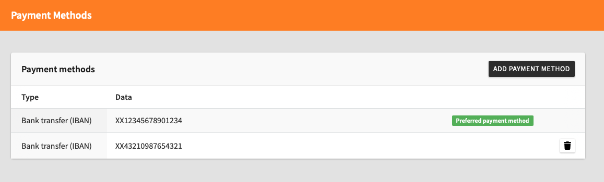
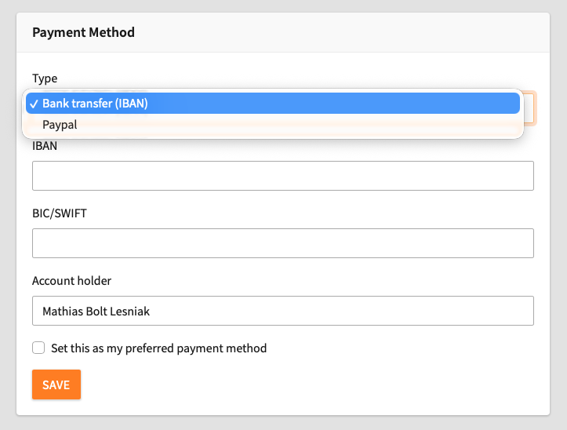
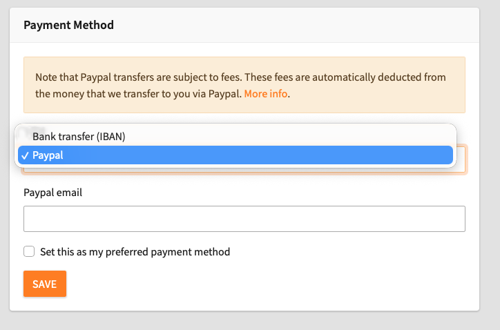

# Add a Payment Method in the Reimbursement Tool

<!-- #Beginner @stefan.busemann @mabolek -->

The TYPO3 Reimbursement Tool is the budget and expense management tool for the TYPO3 ecosystem.

As a TYPO3 contributor, you can use it to request and track reimbursements for expenses, work time, or contribution rewards. Reimbursements are reviewed by the budget owner and transferred to you through PayPal or bank transfer.

## Learning objective

In this step-by-step guide you will add bank or PayPal account information to the Reimbursement Tool.

## Prerequisites

### Tools and technology

* A web browser with internet access.
* A PayPal account or bank account with [IBAN](https://en.wikipedia.org/wiki/International_Bank_Account_Number) or [BIC/SWIFT](https://en.wikipedia.org/wiki/ISO_9362) information.
* A My TYPO3 account ([Sign Up for a My TYPO3 Account](SignUpForAMyTypo3Account.md))

### Knowledge and skills

* None beyond basic computer literacy.

## Log in to the Reimbursement Tool

1. In your web browser, go to [reimbursement.typo3.com](https://reimbursement.typo3.com).
2. If you are not already logged in, click on the gray *Login* button.

You will see the Reimbursement Tool dashboard. It is titled *My Reimbursements*.

## Add a payment method

1. Click on your name in the top right corner to open the user menu.

2. From the user menu, select *Payment Methods*. You will be redirected to the payment methods summary page.

3. Click on the black *Add payment method* button. You will be redirected to the payment method creation form. The form will default to the IBAN payment method.
4. From the *Type* drop-down menu, select either *Bank transfer (IBAN)* or *PayPal*. The form will update accordingly.

The next steps are different, depending on which payment method you selected.

## Fill in the form for Bank transfer (IBAN)

1. In the *Type* drop-down menu, ensure that *Bank transfer (IBAN)* is selected.
2. Fill in the other fields as follows:
    * **IBAN**: Enter your IBAN number, as supplied by your bank. The IBAN consists of up to 34 alphanumeric characters, starting with a two-character country code. For example: `XX12345678901234`
    * **BIC/SWIFT**: Enter your bank’s BIC/SWIFT code, as supplied by your bank. The BIC/SWIFT code consists of up to 11 alphanumeric characters. For example: `FOOBAR123`
    * **Account holder**: The name of the account holder, presumably your name.
3. Check the *Set this as my preferred payment method* checkbox if you would like to use this payment method as your default payment method.
4. Click on the orange *Save* button. You will be redirected to the payment methods summary page.

Your payment method should now be visible in the list on the payment methods summary page.

## Fill in the form for PayPal

1. In the *Type* drop-down menu, ensure that *Bank transfer (IBAN)* is selected.
2. In the *PayPal email* field, enter the email address connected to your PayPal account.
3. Check the *Set this as my preferred payment method* checkbox if you would like to use this payment method as your default payment method.
4. Click on the orange *Save* button. You will be redirected to the payment methods summary page.

Your payment method should now be visible in the list on the payment methods summary page.

> [!CAUTION]
> PayPal transfers are subject to fees. These fees are automatically deducted from the money that is transferred to you via PayPal. [More information on PayPal fees](https://www.paypal.com/en/webapps/mpp/paypal-fees)

## Summary

You have now created a payment method and can receive reimbursements from the TYPO3 Association to your bank or PayPal account.

## Next steps

* [Create a Regular Reimbursement in the Reimbursement Tool](CreateARegularReimbursementInTheReimbursementTool.md)
* [Create a Direct Reimbursement in the Reimbursement Tool](CreateADirectReimbursementInTheReimbursementTool.md)

## Resources

* [IBAN](https://en.wikipedia.org/wiki/International_Bank_Account_Number)
* [BIC/SWIFT](https://en.wikipedia.org/wiki/ISO_9362)
