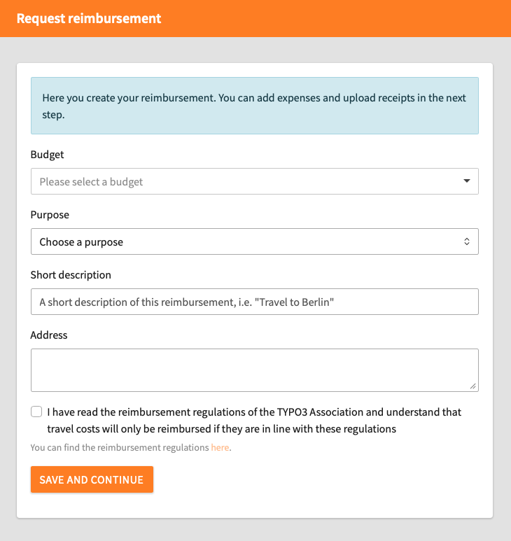
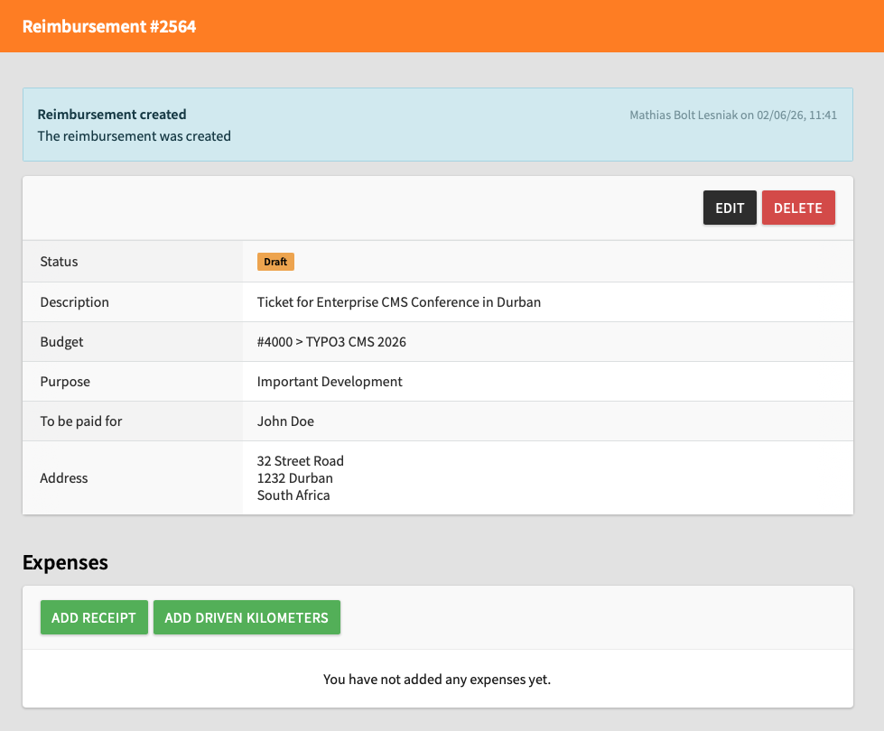
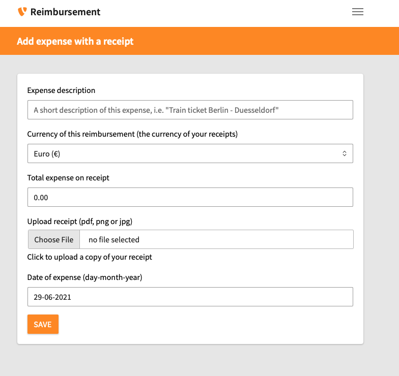

# Create a Direct Reimbursement in the Reimbursement Tool

<!-- #Beginner @stefan.busemann @mabolek -->

The TYPO3 Reimbursement Tool is the budget and expense management tool for the TYPO3 ecosystem.

As a TYPO3 contributor, you can use it to request and track reimbursements for expenses, work time, or contribution rewards. Reimbursements are reviewed by the budget owner and transferred to you through PayPal or bank transfer.

## Learning objective

In this step-by-step guide you will request that the TYPO3 Association pays an invoice directly to the issuer using a *Direct Reimbursement*.

> [!NOTE]
> If you would instead like to reimburse expenses you have paid for, please follow the guide [Create a Regular Reimbursement in the Reimbursement Tool](CreateARegularReimbursementInTheReimbursementTool.md).

## Prerequisites

### Tools and technology

* A web browser with internet access.
* A PayPal account or bank account with [IBAN](https://en.wikipedia.org/wiki/International_Bank_Account_Number) or [BIC/SWIFT](https://en.wikipedia.org/wiki/ISO_9362) information.
* A My TYPO3 account ([Sign Up for a My TYPO3 Account](SignUpForAMyTypo3Account.md))

### Knowledge and skills

* None beyond basic computer literacy.

## Log in to the Reimbursement Tool

1. In your web browser, go to [reimbursement.typo3.com](https://reimbursement.typo3.com).
2. If you are not already logged in, click on the gray *Login* button.

You will see the Reimbursement Tool dashboard. It is titled *My Reimbursements*.

## Create a reimbursement

1. On the Reimbursement Tool dashboard, click the black *Request Reimbursement* button. You will be redirected to a page asking you to choose *Regular Reimbursement* or *Direct Expense*.

2. In the *Direct Reimbursement* box, click the orange *Create* button. You will be redirected to the *request reimbursement* form.

2. Complete the form by filling in the fields:
    * **Budget:** Choose the budget you want to use for this reimbursement.
    * **Purpose**: Choose the purpose that fits with your reimbursement.
    * **Short description:** Describe the purpose of your receipts / expenses. Example: "Invoice for Enterprise CMS Conference in Durban"
    * **Address:** Enter the address of the payment recipient.

> [!NOTE]
> If you are not sure which purpose to choose, please contact the budget owner.

3. Ensure that you have read the [Travel Expense and Reimbursement Regulations](https://docs.typo3.org/permalink/guide-policy:reimbursement) before you check the checkbox.
4. Click the orange *Save and Continue* button. You will be redirected to the reimbursement summary page.

You have now created the reimbursement request itself, and you are ready to add an invoice to be paid directly to the issuer by the TYPO3 Association.

> [!INFO]
> The reimbursement request will be in draft status and only visible to you until you submit it for approval.

> [!INFO]
> You can normally add two types of expenses to a reimbursement (*receipts* and *driven kilometers*), but a direct reimbursement will usually only concern invoices (called *receipts* in the TYPO3 Reimbursement Tool).

## Add an invoice or receipt

We are now going to add an invoice or receipt and the necessary documentation. You must repeat this step for every invoice or receipt. We recommend submitting separate reimbursement requests for each invoice issuer.

> [!WARNING]
> All invoices and recepts must comply with the [Travel Expense and Reimbursement Regulations](https://docs.typo3.org/permalink/guide-policy:reimbursement). Take particular note of the [general documentation](https://docs.typo3.org/permalink/guide-policy:reimbursement-regulations-5) and [invoice](https://docs.typo3.org/permalink/guide-policy:reimbursement-regulations-4) requirements.

1. On the reimbursement summary page, click the *Add receipt* button. You will be redirected to the *Add expense with a receipt* form.

2. Complete the form by filling in the fields:
    * **Expense description:** Enter a short description of what the expense is for. Example: "Ticket for Enterprise CMS Conference in Durban"
    * **Currency of this reimbursement** Choose the currency of the expense.
    * **Total expense on receipt:** To avoid errors, all the digits should be entered as an integer, including the subunit amount (e.g., cents), without a decimal point. For example: `100.00` is entered as `10000`.
    * **Upload receipt:** Upload the invoice or receipt scanned or photographed as a PDF, PNG, or JPG file.
    * **Date of expense:** Click on the field and select a date from the pop-up calendar. The date must be the same as the date on the invoice or receipt.
3. Click the orange *Save* button. You will be redirected to the reimbursement summary page.

> [!INFO]
> The TYPO3 Association is domiciled in Switzerland. If the invoice issuer is a foreign company, sales tax should often not be included.

## Submit the reimbursement for approval

When you have added all expenses, you can submit the reimbursement for approval.

1. On the reimbursement summary page, click the *Submit for approval* button.

The budget owner will be notified about the new reimbursement request.

> [!WARNING]
> If you are the budget owner, you cannot approve your own reimbursement requests. Please notify the responsible board member that your request is ready for review.

## Summary

You have now created a reimbursement request and submitted it for approval. The money will be transferred to the invoice issuer within 14 days after the budget owner has approved your request.

## Next steps

Once the payment has been received, you can change the status of the reimbursement to *Paid* by clicking on the *Mark as paid* button on the reimbursement summary page.

## Resources

* [The European Central Bank’s Euro foreign exchange reference rates](https://www.ecb.europa.eu/stats/policy_and_exchange_rates/euro_reference_exchange_rates/html/index.en.html)
