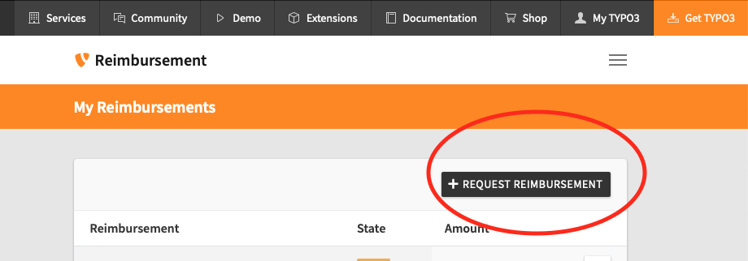
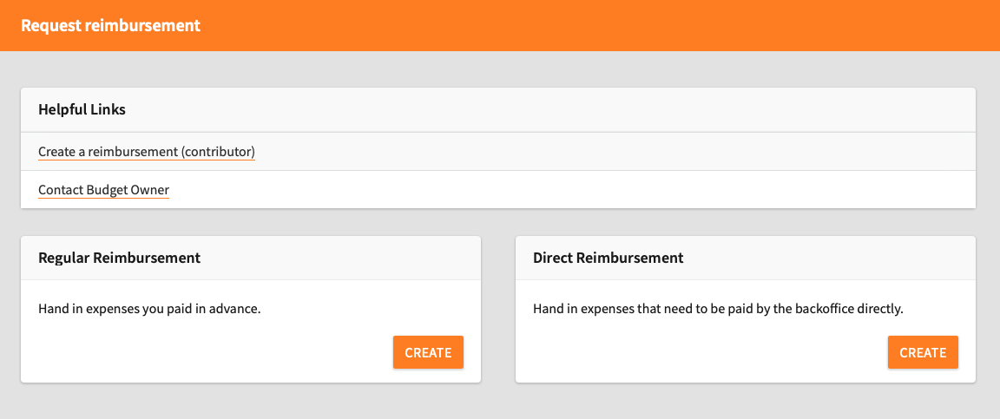
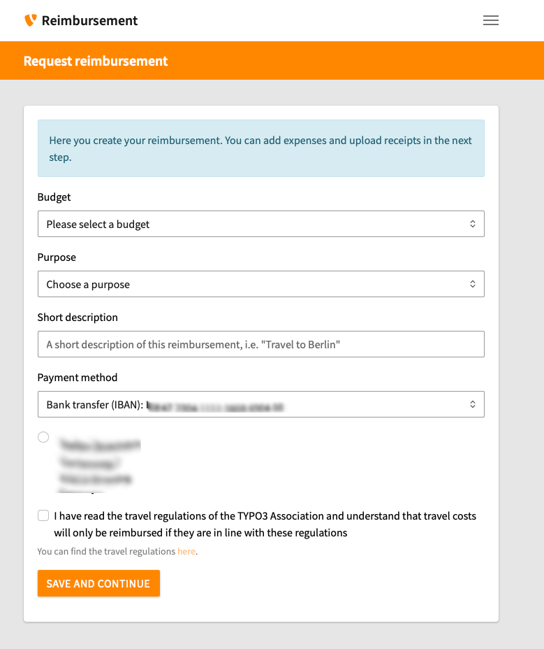
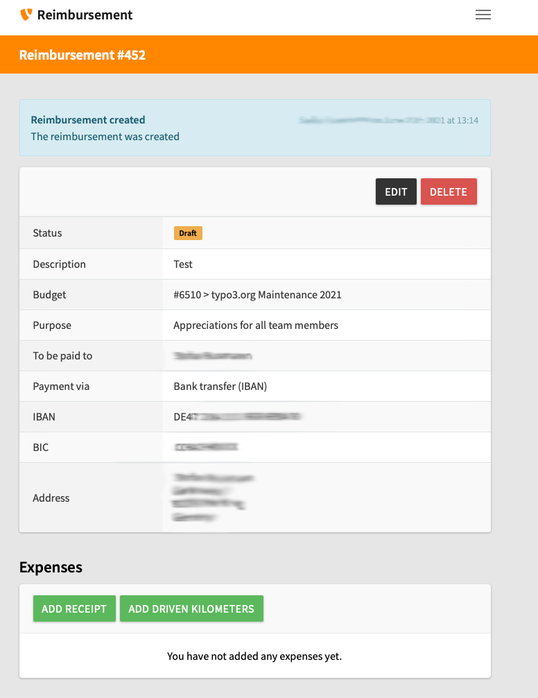
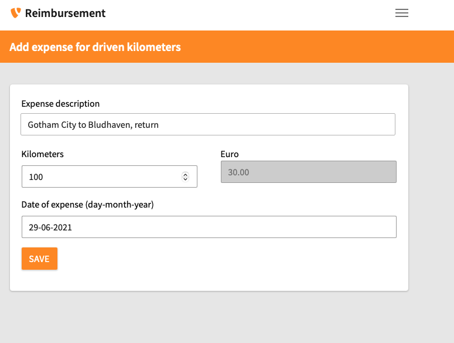

# Create a Regular Reimbursement in the Reimbursement Tool

 **Categories:** [Beginner](/Tags/Beginner.md) **Author:** [@mabolek](https://my.typo3.org/u/mabolek)

The TYPO3 Reimbursement Tool is the budget and expense management tool for the TYPO3 ecosystem.

As a TYPO3 contributor, you can use it to request and track reimbursements for expenses, work time, or contribution rewards. Reimbursements are reviewed by the budget owner and transferred to you through PayPal or bank transfer.

## Learning objective

In this step-by-step guide you will create a reimbursement for expenses incurred and submit it for approval.

> [!NOTE]
> If you would instead like to request that the TYPO3 Association pays an invoice directly to the issuer, instead of reimbursing an expense, please follow the guide [Create a Direct Expense in the Reimbursement Tool](/70ForOfficialRoles/BudgetsAndExpenses/CreateADirectReimbursementInTheReimbursementTool.md).

## Prerequisites

### Tools and technology

* A web browser with internet access.
* A payment method registered in the TYPO3 Reimbursement Tool. See: [Add a Payment Method in the Reimbursement Tool](/70ForOfficialRoles/BudgetsAndExpenses/AddAPaymentMethodInTheReimbursementTool.md).
* A My TYPO3 account ([Sign Up for a My TYPO3 Account](/10GettingStarted/05MeetTheCommunity/SignUpForAMyTypo3Account.md))

### Knowledge and skills

* Familiarity with the [Travel Expense and Reimbursement Regulations for the TYPO3 Association](https://docs.typo3.org/permalink/guide-policy:reimbursement)

## Log in to the Reimbursement Tool

1. In your web browser, go to [reimbursement.typo3.com](https://reimbursement.typo3.com).
2. If you are not already logged in, click on the gray *Login* button.

You will see the Reimbursement Tool dashboard. It is titled *My Reimbursements*.

## Create a reimbursement

1. On the Reimbursement Tool dashboard, click the black *Request Reimbursement* button. You will be redirected to a page asking you to choose *Regular Reimbursement* or *Direct Expense*.

2. In the *Regular Reimbursement* box, click the orange *Create* button. You will be redirected to the *request reimbursement* form.

2. Complete the form by filling in the fields:
    * **Budget:** Choose the budget you want to use for this reimbursement.
    * **Purpose**: Choose the purpose that fits with your reimbursement.
    * **Short description:** Describe the purpose of your receipts / expenses. Example: "Travel to the TYPO3 Camp in Berlin"
    * **Payment method:** Choose how you would like the TYPO3 Association to transfer the money to you.

> [!NOTE]
> If you are not sure which purpose to choose, please contact the budget owner.

3. Ensure that you have read the [Travel Expense and Reimbursement Regulations](https://docs.typo3.org/permalink/guide-policy:reimbursement) before you check the checkbox.
4. Click the orange *Save and Continue* button. You will be redirected to the reimbursement summary page.

You have now created the reimbursement request itself, and you are ready to document your expenses.

> [!NOTE]
> The reimbursement request will be in draft status and only visible to you until you submit it for approval.

> [!NOTE]
> You can add two types of expenses to your reimbursement:
>
> * **Receipt:** Any invoice or receipt that is applicable for reimbursement.
> * **Driven kilometers:** Travel by private car, reimbursed at a per-kilometer rate.

## Add an invoice or receipt

We are now going to add an invoice or receipt and the necessary documentation. You must repeat this step for every invoice or receipt.

> [!NOTE]
> If you are only reimbursing driven kilometers and have no invoice or receipt to submit, you can skip this part.

> [!WARNING]
> All invoices and recepts must comply with the [Travel Expense and Reimbursement Regulations](https://docs.typo3.org/permalink/guide-policy:reimbursement). Take particular note of the [general documentation](https://docs.typo3.org/permalink/guide-policy:reimbursement-regulations-5) and [invoice](https://docs.typo3.org/permalink/guide-policy:reimbursement-regulations-4) requirements.

1. On the reimbursement summary page, click the *Add receipt* button. You will be redirected to the *Add expense with a receipt* form.

2. Complete the form by filling in the fields:
    * **Expense description:** Enter a short description of what the expense is for. Example: "Train ticket Berlin–Düsseldorf"
    * **Currency of this reimbursement** Choose the currency of the expense.
    * **Total expense on receipt:** To avoid errors, all of the digits should be entered as an integer including the subunit amount (e.g., cents), without a decimal point. For example: `100.00` is entered as `10000`.
    * **Upload receipt:** Upload the invoice or receipt scanned or photographed as a PDF, PNG, or JPG file.
    * **Date of expense:** Click on the field and select a date from the pop-up calendar. The date must be the same as the date on the invoice or receipt.
 3. Click the orange *Save* button. You will be redirected to the reimbursement summary page.

You should repeat this step for every invoice or receipt you want to submit.

> [!NOTE]
> The TYPO3 Association is domiciled in Switzerland. If you reimburse as a foreign company, sales tax should not be included.

## Add expense for driven kilometers

If travel by car is necessary and [sanctioned by the regulations](https://docs.typo3.org/permalink/guide-policy:reimbursement-regulations-2g), you can reimburse driven kilometers.

1. On the reimbursement summary page, click the *Add driven kilometers* button. You will be redirected to the *Add expense for driven kilometers* form.

2. Complete the form by filling in the fields:
    * **Expense description:** Enter information about your journey’s origin and destination.
    * **Kilometers:** Enter the total number of kilometers driven. The reimbursed amount will be calculated automatically.
    * **Date of expense**: Click on the field and select the date of your journey from the pop-up calendar.
3. Click the orange *Save* button. You will be redirected to the reimbursement summary page.

You should repeat this step for every journey you want to reimburse.

## Submit the reimbursement for approval

When you have added all expenses, you can submit the reimbursement for approval.

1. On the reimbursement summary page, click the *Submit for approval* button.

The budget owner will be notified about the new reimbursement request.

> [!WARNING]
> If you are the budget owner, you cannot approve your own reimbursement requests. Please notify the responsible board member that your request is ready for review.

## Summary

You have now created a reimbursement request and submitted it for approval. The money will be transferred to you within 14 days after the budget owner has approved your request.

## Next steps

Once you have received your reimbursement, you can change the status of the reimbursement to *Paid* by clicking on the *Mark as paid* button on the reimbursement summary page.

## Resources

* [The European Central Bank’s Euro foreign exchange reference rates](https://www.ecb.europa.eu/stats/policy_and_exchange_rates/euro_reference_exchange_rates/html/index.en.html)
