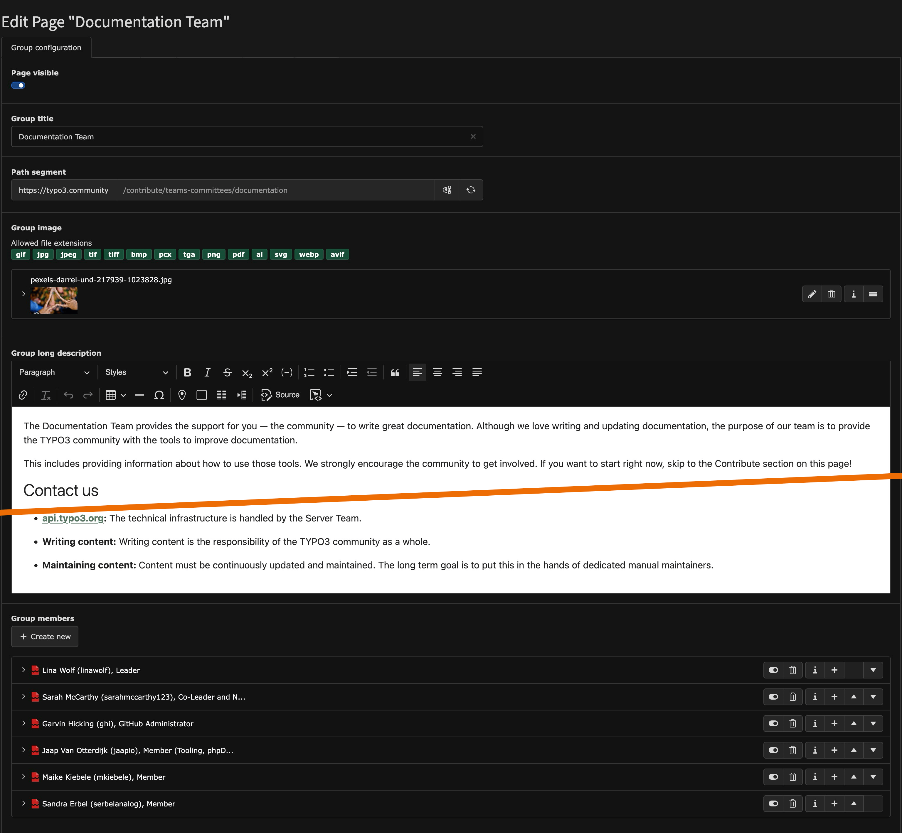

# Edit an Official TYPO3 Team or Committee Page

 **Tested in:** [TYPO3v13](/Tags/TYPO3v13.md) **Categories:** [Intermediary](/Tags/Intermediary.md) [Backend](/Tags/Backend.md) [Editing](/Tags/Editing.md) **Author:** [@mabolek](https://my.typo3.org/u/mabolek)

All official TYPO3 teams and committees have a page at [typo3.community](https://typo3.community). This page is used to explain what the team or committee is, how they function, and to display the team members and their roles. Team and committee leads can edit their pages through the TYPO3 backend.

## Learning objective

In this step-by-step guide you will edit the page of a team or committee through the TYPO3 backend.

## Prerequisites

### Tools and technology

* Access to a TYPO3 backend (editor or admin account)
* A web browser

### Knowledge and skills

* You know how to *Log in to the TYPO3 backend* [(CREATE)](https://github.com/TYPO3-Documentation/TYPO3CMS-Guide-StepByStep/new/contrib/Documentation/00Incoming?filename=LogInToTheTYPO3Backend.md&value=Copy%20content%20the%20template%20from%3A%20https%3A%2F%2Fraw.githubusercontent.com%2FTYPO3-Documentation%2FTYPO3CMS-Guide-StepByStep%2Frefs%2Fheads%2Fcontrib%2FDocumentation%2F90Contribute%2F10Template%2FIndex.md "Create this missing step-by-step guide")
* You know how to [Modify the Page Properties](/10GettingStarted/20BasicConfiguration/10BackendBasics/ModifyingThePageProperties.md)

## Access the page properties

All of the editable page content for a basic team or committee page is stored in the Page record, so you will not have to edit content elements.

1. Log in to the typo3.community backend at [typo3.community/typo3](https://typo3.community/typo3/) as explained in *Log in to the TYPO3 backend* [(CREATE)](https://github.com/TYPO3-Documentation/TYPO3CMS-Guide-StepByStep/new/contrib/Documentation/00Incoming?filename=LogInToTheTYPO3Backend.md&value=Copy%20content%20the%20template%20from%3A%20https%3A%2F%2Fraw.githubusercontent.com%2FTYPO3-Documentation%2FTYPO3CMS-Guide-StepByStep%2Frefs%2Fheads%2Fcontrib%2FDocumentation%2F90Contribute%2F10Template%2FIndex.md "Create this missing step-by-step guide"). You should see your team or committee’s page in the page tree with an orange icon ().
2. Access the page’s page properties as explained in [Modify the Page Properties](/10GettingStarted/20BasicConfiguration/10BackendBasics/ModifyingThePageProperties.md).

## Modify the page content in the page properties

1. Make sure the *Group configuration* tab is selected. It should look something like this:

2. Edit the fields as required.
   * **Page visible:** Setting this option to disabled will hide your page. Use if your team or committee has been disbanded.
   * **Group title:** The name of your team or committee.
   * **Path segment:** The URL path for your team or committee page. *(You should not change this unless your team or committee has been renamed.)*
   * **Group image:** The image that will be displayed on your team or committee page and on cards elsewhere on the TYPO3 websites.
   * **Group short description:** A short description of your team or committee that will be displayed on your team or committee pageand on cards elsewhere on the TYPO3 websites.
   * **Group long description:** A long description of your team or committee. Include information on
     * The tasks of your team or committee.
     * Information about regular meetings.
     * How to contact you, e.g., on TYPO3 Slack.
     * The process for joining and leaving.
     * Links to the output of your team or committee.
   * **Group members:** Add or remove team members.
     * **Select user:** Select the team member's user from the list.
     * **Override role:** Enter the team member's role, or simply "Member".
3. Save the changes.

## Summary

Congratulations! You now have updated the information on your team or committee page.

## Next steps

Now that you have updated the information, you might like to:

* Let your team members know about the changes.
* Tell about the updated information on social media.
* Encourage new members to join your team or committee.

## Resources

* [TYPO3 Association Policy for Committees & Official Teams](https://docs.typo3.org/permalink/guide-policy:team-policy)
